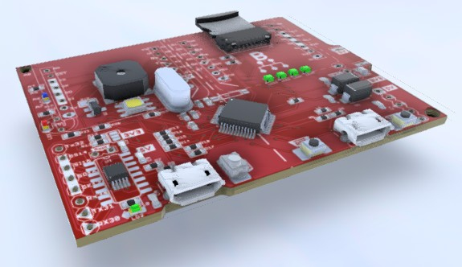
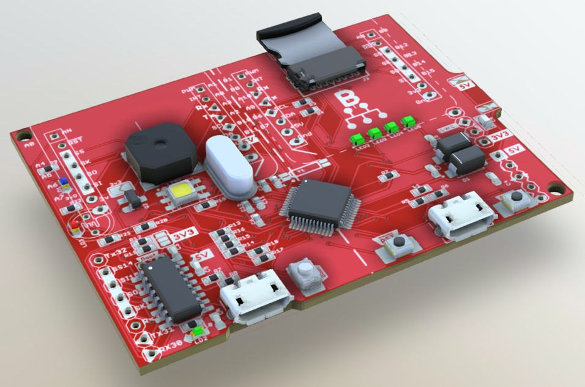
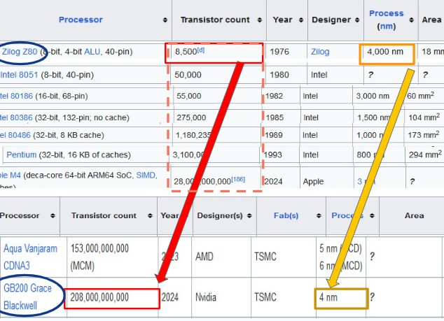
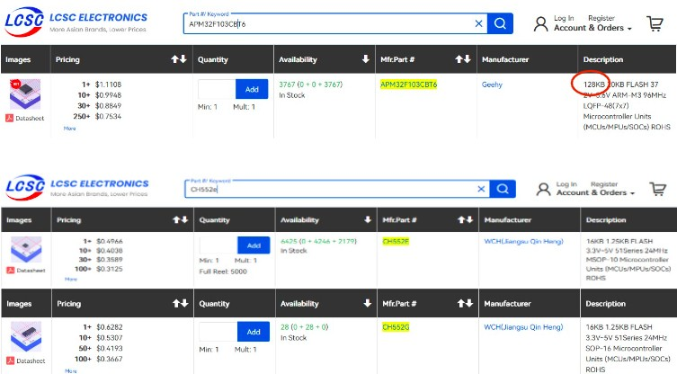
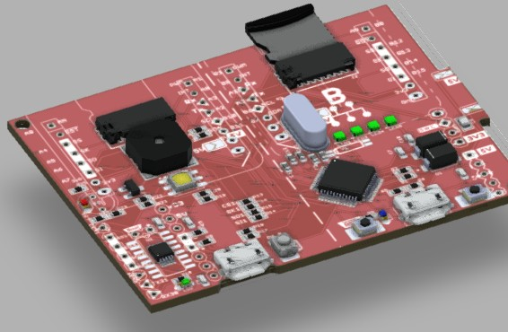
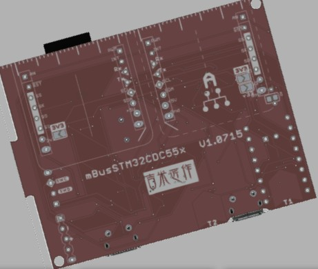

# mBusSTM32USB
mBus sockets w/ **8051&Arm-M3**, work in process!
Please check  for the latest changes!

 &nbsp;&nbsp; 
 
 
Z80 ~~is calling~~ called **_LastBuy_** by 06/14-2024, what's changed in 50 years! 
 

With **_Shared_** MCUs in China, the hardware price is quite affordable! 
有了大陸国内共享MCU，硬件价格实在是贼便宜的!! 

 
 

## 0715 Updates:
- Update circuit layout in hardware.  
- Add more CH55x USB projects (USB Control/Interrupt/Bulk transfer w/ PlatformIO-WCH51) in firmware folder.  
  Also attached the pyUSB Host test jig for individual testing in each folder (NEED _libUSB_ as USB driver).  
  Finally, add the HID+CDC project that monitoring HID traffics with USB-CDC serial. 
  
      

   
---

## References  

- [SDCC](https://sdcc.sourceforge.net/) SDCC - Small Device C Compiler.  
- [MCS-51s](https://github.com/SoCXin/MCS-51) 嵌入式应用的单片微型计算机的经典体系结构.   
- [Fake pills](https://github.com/keirf/Greaseweazle/wiki/STM32-Fakes) About fake pills.  
- [CH559 baremetal programming](https://kprasadvnsi.com/tags/ch559/)
- [CH559 DOC](https://kprasadvnsi.github.io/CH559_Doc_English/docs/16-usb/) Brief CH559 english document.
- [CH55xG Pinout](https://oshwlab.com/wagiminator/ch55xg-development-board) CH55xG Dev Board.
- [CH55x Getting start](https://rabid-inventor.blogspot.com/2020/05/getting-started-with-ch55x.html) Getting started with the CH55x Microcontroller.
